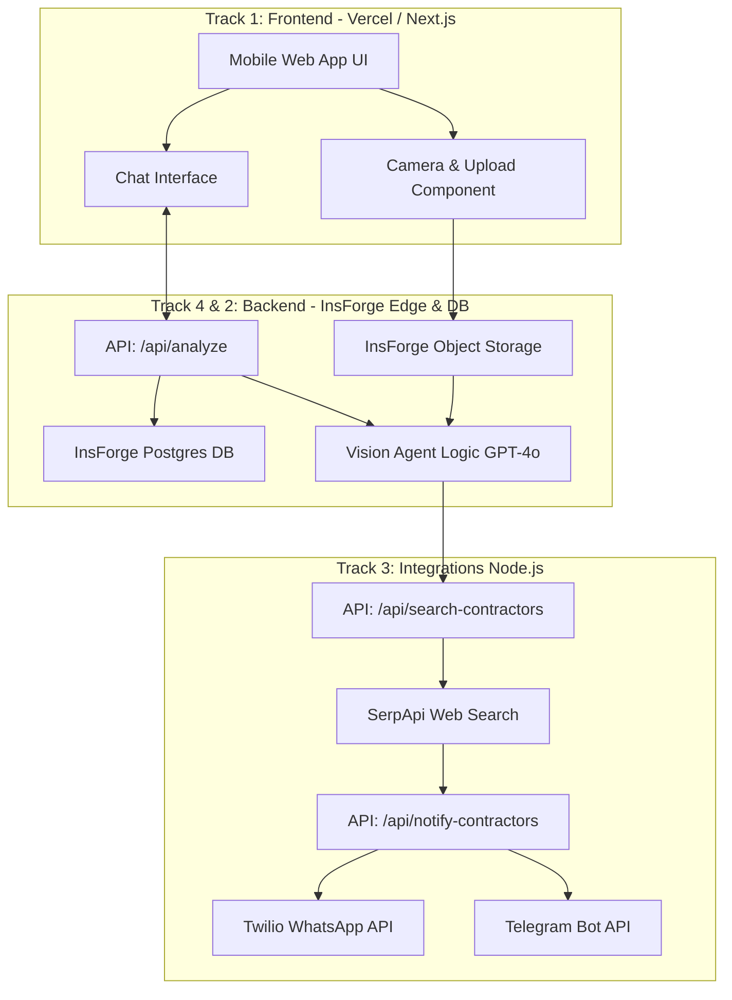

# Complete System Architecture & Data Flow

> [!TIP]
> **Executive Summary:** This document defines the exact architecture, data flows, and infrastructure required to build the AI Maintenance Agent in 5 hours using the sponsored tools (Vercel, InsForge, Replicas, Limrun).

## System Component Diagram
Below is the system component diagram. Ensure everyone understands this before writing code.

## Detailed Data Flow Breakdown

### 1. The Capture Phase
1. User clicks "Take Photo" in the Vercel-hosted frontend.
2. The image is passed to `track_1_frontend`'s upload utility.
3. The upload utility hits the `track_4_data_ops` signed URL generator.
4. The image is uploaded directly to **InsForge Object Storage**, returning a public URL (e.g., `https://storage.insforge.com/bucket/img_123.jpg`).

### 2. The Analysis Phase
1. Frontend calls `POST /api/analyze` passing the `imageUrl`.
2. The **InsForge Edge Function** (owned by `track_2_ai_agent`) receives the request.
3. It constructs the vision prompt and queries the AI model (OpenAI/Anthropic).
4. The AI returns a JSON response identifying the model or asking for more info.
5. If it needs more info, the flow returns to the user.

### 3. The Action Phase
1. Once identified (e.g., "Carrier AC"), the backend triggers `POST /api/search-contractors`.
2. **Track 3's** integration logic queries SerpApi for "HVAC repair San Francisco".
3. The response is parsed to extract names and phone numbers.
4. The backend then triggers `POST /api/notify-contractors`.
5. Twilio fires off automated WhatsApp messages to the contractors containing the user's uploaded `imageUrl` and urgency.

## Sponsor Tool Utilization Map
*   **Vercel:** Hosting the Next.js frontend for instant global distribution and edge caching.
*   **InsForge:** Handling the database, file storage, and running the edge functions that interact with the LLMs.
*   **Replicas:** Delegating the creation of the boilerplate schemas, Twilio integrations, and UI components to background AI agents.
*   **Limrun:** If compiling to a native iOS/Android app, using cloud infrastructure to test the camera functionality natively instead of through a web wrapper.
