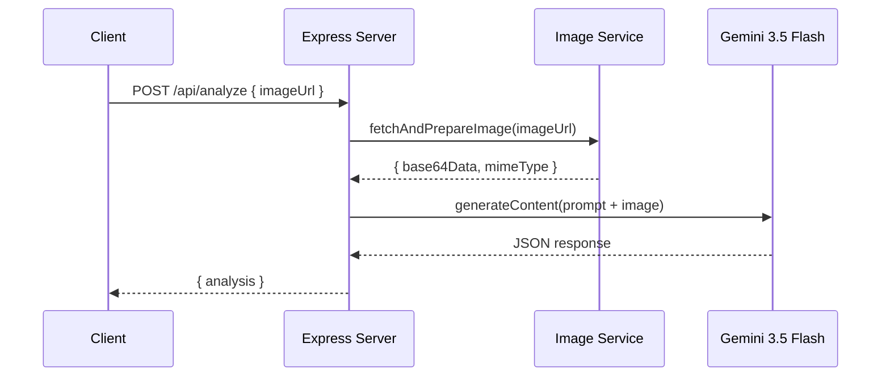

# Gemini 3.5 Flash Vision Integration

> [!IMPORTANT]
> **Executive Summary:** Complete integration guide for calling Gemini 3.5 Flash vision capabilities using the `@google/generative-ai` SDK. This covers client initialization, image fetching and base64 conversion, content generation with inline image data, JSON response parsing, error handling, and retry logic with exponential backoff.

---

## Architecture Overview



---

## Step 1: Install the SDK

```bash
npm install @google/generative-ai
```

## Step 2: Initialize the Client

```javascript
// src/services/visionService.js

import { GoogleGenerativeAI } from '@google/generative-ai';
import dotenv from 'dotenv';

dotenv.config();

const genAI = new GoogleGenerativeAI(process.env.GEMINI_API_KEY);

const model = genAI.getGenerativeModel({
  model: 'gemini-3.5-flash',
  generationConfig: {
    temperature: 0.1,       // Low temperature for consistent JSON output
    topP: 0.95,
    maxOutputTokens: 1024,  // JSON responses are compact
  },
});
```

> [!WARNING]
> **Never hardcode your API key.** Always use environment variables. Add `.env` to your `.gitignore` immediately.

> [!TIP]
> Set `temperature: 0.1` for structured JSON output. Higher temperatures introduce variability that can break JSON parsing.

---

## Step 3: Fetch Image and Convert to Base64

```javascript
// src/services/imageService.js

import fetch from 'node-fetch';

const SUPPORTED_MIME_TYPES = ['image/jpeg', 'image/png', 'image/webp'];
const MAX_IMAGE_SIZE = 20 * 1024 * 1024; // 20MB

export async function fetchAndPrepareImage(imageUrl) {
  // 1. Fetch the image with a timeout
  const controller = new AbortController();
  const timeout = setTimeout(() => controller.abort(), 10000); // 10s timeout

  let response;
  try {
    response = await fetch(imageUrl, { signal: controller.signal });
  } catch (err) {
    if (err.name === 'AbortError') {
      throw new Error(`Image fetch timed out after 10s: ${imageUrl}`);
    }
    throw new Error(`Failed to fetch image: ${err.message}`);
  } finally {
    clearTimeout(timeout);
  }

  if (!response.ok) {
    throw new Error(`Image fetch failed with HTTP ${response.status}: ${imageUrl}`);
  }

  // 2. Validate MIME type
  const contentType = response.headers.get('content-type')?.split(';')[0]?.trim();
  if (!SUPPORTED_MIME_TYPES.includes(contentType)) {
    throw new Error(`Unsupported image type: ${contentType}. Supported: ${SUPPORTED_MIME_TYPES.join(', ')}`);
  }

  // 3. Read buffer and validate size
  const buffer = Buffer.from(await response.arrayBuffer());
  if (buffer.length > MAX_IMAGE_SIZE) {
    throw new Error(`Image too large: ${(buffer.length / 1024 / 1024).toFixed(1)}MB (max ${MAX_IMAGE_SIZE / 1024 / 1024}MB)`);
  }

  if (buffer.length === 0) {
    throw new Error('Image is empty (0 bytes)');
  }

  // 4. Convert to base64
  return {
    base64Data: buffer.toString('base64'),
    mimeType: contentType,
  };
}
```

---

## Step 4: Send Image to Gemini 3.5 Flash

```javascript
// src/services/visionService.js (continued)

import { VISION_SYSTEM_PROMPT } from '../prompts/visionPrompt.js';
import { fetchAndPrepareImage } from './imageService.js';

export async function analyzeImage(imageUrl) {
  const { base64Data, mimeType } = await fetchAndPrepareImage(imageUrl);

  const result = await model.generateContent([
    { text: VISION_SYSTEM_PROMPT },
    { text: 'Analyze this home maintenance issue from the photo.' },
    {
      inlineData: {
        mimeType,
        data: base64Data,
      },
    },
  ]);

  const responseText = result.response.text();
  return parseGeminiResponse(responseText);
}
```

---

## Step 5: Parse the JSON Response

```javascript
function parseGeminiResponse(responseText) {
  // Strip markdown fencing if Gemini wraps in ```json blocks
  let cleaned = responseText.trim();
  if (cleaned.startsWith('```')) {
    cleaned = cleaned.replace(/^```(?:json)?\n?/, '').replace(/\n?```$/, '').trim();
  }

  try {
    const parsed = JSON.parse(cleaned);
    return validateAnalysisResponse(parsed);
  } catch (err) {
    console.error('Gemini response parse error:', err.message);
    console.error('Raw response:', responseText);
    throw new Error('Gemini 3.5 Flash returned non-JSON response');
  }
}

function validateAnalysisResponse(data) {
  const required = ['status', 'isIdentified', 'category', 'messageToUser'];
  for (const field of required) {
    if (data[field] === undefined) {
      throw new Error(`Missing required field in Gemini response: "${field}"`);
    }
  }

  const validCategories = ['hvac', 'electrical', 'plumbing', 'unknown'];
  if (!validCategories.includes(data.category)) {
    console.warn(`Unexpected category "${data.category}", defaulting to "unknown"`);
    data.category = 'unknown';
  }

  const validUrgency = ['low', 'medium', 'high', 'critical'];
  if (data.urgencyLevel && !validUrgency.includes(data.urgencyLevel)) {
    data.urgencyLevel = 'medium';
  }

  return data;
}
```

---

## Step 6: Error Handling & Retry Logic

```javascript
// src/utils/retry.js

export async function withRetry(fn, { maxRetries = 3, baseDelay = 1000, maxDelay = 10000 } = {}) {
  let lastError;

  for (let attempt = 1; attempt <= maxRetries; attempt++) {
    try {
      return await fn();
    } catch (err) {
      lastError = err;
      console.warn(`Attempt ${attempt}/${maxRetries} failed: ${err.message}`);

      // Don't retry on validation errors (client-side issue)
      if (err.message.includes('Missing required field') || err.message.includes('Unsupported image')) {
        throw err;
      }

      if (attempt < maxRetries) {
        const delay = Math.min(baseDelay * Math.pow(2, attempt - 1), maxDelay);
        const jitter = delay * (0.5 + Math.random() * 0.5);
        console.log(`Retrying in ${Math.round(jitter)}ms...`);
        await new Promise(resolve => setTimeout(resolve, jitter));
      }
    }
  }

  throw lastError;
}
```

### Using Retry with the Vision Service

```javascript
import { withRetry } from '../utils/retry.js';

export async function analyzeImageWithRetry(imageUrl) {
  return withRetry(() => analyzeImage(imageUrl), {
    maxRetries: 3,
    baseDelay: 1000,
  });
}
```

---

## Complete Module Export

```javascript
// src/services/visionService.js — Full file

import { GoogleGenerativeAI } from '@google/generative-ai';
import { VISION_SYSTEM_PROMPT } from '../prompts/visionPrompt.js';
import { fetchAndPrepareImage } from './imageService.js';
import { withRetry } from '../utils/retry.js';

const genAI = new GoogleGenerativeAI(process.env.GEMINI_API_KEY);
const model = genAI.getGenerativeModel({
  model: 'gemini-3.5-flash',
  generationConfig: {
    temperature: 0.1,
    topP: 0.95,
    maxOutputTokens: 1024,
  },
});

async function analyzeImage(imageUrl) {
  const { base64Data, mimeType } = await fetchAndPrepareImage(imageUrl);

  const result = await model.generateContent([
    { text: VISION_SYSTEM_PROMPT },
    { text: 'Analyze this home maintenance issue from the photo.' },
    {
      inlineData: { mimeType, data: base64Data },
    },
  ]);

  return parseGeminiResponse(result.response.text());
}

function parseGeminiResponse(responseText) {
  let cleaned = responseText.trim();
  if (cleaned.startsWith('```')) {
    cleaned = cleaned.replace(/^```(?:json)?\n?/, '').replace(/\n?```$/, '').trim();
  }

  const parsed = JSON.parse(cleaned);
  return validateAnalysisResponse(parsed);
}

function validateAnalysisResponse(data) {
  const required = ['status', 'isIdentified', 'category', 'messageToUser'];
  for (const field of required) {
    if (data[field] === undefined) {
      throw new Error(`Missing required field: "${field}"`);
    }
  }
  return data;
}

export async function analyzeImageWithRetry(imageUrl) {
  return withRetry(() => analyzeImage(imageUrl), { maxRetries: 3 });
}

export { analyzeImage };
```

> [!TIP]
> **Response times:** Gemini 3.5 Flash typically responds in 1–3 seconds for image analysis. Set your Express timeout to at least 15 seconds to account for retries.

---

## Checklists

- [ ] `@google/generative-ai` package installed
- [ ] `GEMINI_API_KEY` set in `.env`
- [ ] `visionService.js` exports `analyzeImage` and `analyzeImageWithRetry`
- [ ] `imageService.js` exports `fetchAndPrepareImage`
- [ ] Response validation checks all required fields
- [ ] Retry logic with exponential backoff implemented
- [ ] Error handling for: API errors, rate limits, non-JSON responses, missing fields
- [ ] Tested with a real image URL and verified JSON output
