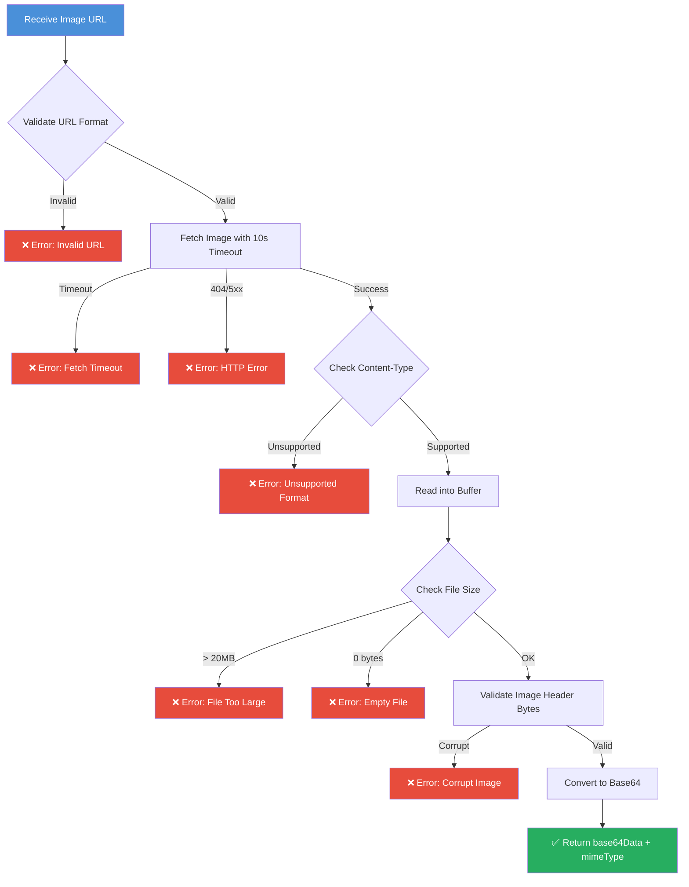

# Image Processing Pipeline

> [!IMPORTANT]
> **Executive Summary:** This document covers the full image processing pipeline — fetching images from URLs, converting to base64 for Gemini 3.5 Flash, validating formats and sizes, and handling all error cases (404, timeout, corrupt images, unsupported formats). The pipeline is implemented in `src/services/imageService.js`.

---

## Pipeline Overview



---

## Supported Image Formats

| Format | MIME Type | Max Size | Notes |
|--------|-----------|----------|-------|
| JPEG | `image/jpeg` | 20 MB | Most common for phone camera photos |
| PNG | `image/png` | 20 MB | Supports transparency; larger file sizes |
| WebP | `image/webp` | 20 MB | Modern format; smaller than JPEG at same quality |

> [!NOTE]
> Gemini 3.5 Flash supports additional formats (GIF, BMP), but we restrict to JPEG/PNG/WebP for reliability and consistency. These three formats cover 99%+ of user-uploaded photos.

---

## Size Limits

| Constraint | Limit | Rationale |
|-----------|-------|-----------|
| Max file size | **20 MB** | Gemini API inline data limit |
| Fetch timeout | **10 seconds** | Prevents hanging on slow CDNs |
| Max URL length | **2048 chars** | Standard URL length limit |
| Min file size | **> 0 bytes** | Rejects empty/corrupt downloads |

> [!WARNING]
> **Large images consume memory.** A 20MB image becomes ~27MB when base64 encoded. Ensure your server has at least 256MB of available memory. For production, consider adding image resizing before base64 conversion.

---

## Complete Implementation

### Core: `fetchAndPrepareImage()`

```javascript
// src/services/imageService.js

import fetch from 'node-fetch';

const SUPPORTED_MIME_TYPES = ['image/jpeg', 'image/png', 'image/webp'];
const MAX_IMAGE_SIZE = 20 * 1024 * 1024; // 20 MB
const FETCH_TIMEOUT_MS = 10_000;          // 10 seconds
const MAX_URL_LENGTH = 2048;

// Magic bytes for image format validation
const MAGIC_BYTES = {
  'image/jpeg': [0xFF, 0xD8, 0xFF],
  'image/png':  [0x89, 0x50, 0x4E, 0x47],
  'image/webp': null, // Checked via 'RIFF' + 'WEBP' pattern
};

/**
 * Fetches an image from a URL and prepares it for Gemini 3.5 Flash.
 *
 * @param {string} imageUrl - The URL of the image to fetch
 * @returns {Promise<{base64Data: string, mimeType: string}>}
 * @throws {Error} On validation failure, network error, or timeout
 */
export async function fetchAndPrepareImage(imageUrl) {
  // Step 1: Validate URL format
  validateUrl(imageUrl);

  // Step 2: Fetch with timeout
  const response = await fetchWithTimeout(imageUrl, FETCH_TIMEOUT_MS);

  // Step 3: Validate Content-Type
  const mimeType = extractMimeType(response);
  if (!SUPPORTED_MIME_TYPES.includes(mimeType)) {
    throw new Error(
      `Unsupported image format: "${mimeType}". Supported formats: ${SUPPORTED_MIME_TYPES.join(', ')}`
    );
  }

  // Step 4: Read buffer
  const buffer = Buffer.from(await response.arrayBuffer());

  // Step 5: Validate size
  validateImageSize(buffer);

  // Step 6: Validate image header (magic bytes)
  validateImageHeader(buffer, mimeType);

  // Step 7: Convert to base64
  const base64Data = buffer.toString('base64');

  console.log(`Image processed: ${mimeType}, ${(buffer.length / 1024).toFixed(1)}KB, base64 length: ${base64Data.length}`);

  return { base64Data, mimeType };
}
```

### Helper: `validateUrl()`

```javascript
function validateUrl(url) {
  if (!url || typeof url !== 'string') {
    throw new Error('Image URL is required and must be a string');
  }

  if (url.length > MAX_URL_LENGTH) {
    throw new Error(`URL exceeds maximum length of ${MAX_URL_LENGTH} characters`);
  }

  try {
    const parsed = new URL(url);
    if (!['http:', 'https:'].includes(parsed.protocol)) {
      throw new Error(`Invalid protocol: "${parsed.protocol}". Only HTTP and HTTPS are supported.`);
    }
  } catch (err) {
    if (err.message.includes('Invalid protocol')) throw err;
    throw new Error(`Invalid URL format: "${url}"`);
  }
}
```

### Helper: `fetchWithTimeout()`

```javascript
async function fetchWithTimeout(url, timeoutMs) {
  const controller = new AbortController();
  const timeout = setTimeout(() => controller.abort(), timeoutMs);

  try {
    const response = await fetch(url, {
      signal: controller.signal,
      headers: {
        'User-Agent': 'MaintenanceAgent/1.0',
        'Accept': 'image/jpeg, image/png, image/webp',
      },
    });

    if (!response.ok) {
      const statusMessages = {
        400: 'Bad request — check the image URL',
        403: 'Access forbidden — the image may be behind authentication',
        404: 'Image not found — the URL may be expired or incorrect',
        429: 'Rate limited — too many requests to the image host',
        500: 'Image server error — try again later',
      };
      const detail = statusMessages[response.status] || 'Unexpected error';
      throw new Error(`Image fetch failed: HTTP ${response.status} — ${detail}`);
    }

    return response;
  } catch (err) {
    if (err.name === 'AbortError') {
      throw new Error(`Image fetch timed out after ${timeoutMs / 1000}s. The image host may be slow or unreachable.`);
    }
    throw err;
  } finally {
    clearTimeout(timeout);
  }
}
```

### Helper: `extractMimeType()`

```javascript
function extractMimeType(response) {
  const contentType = response.headers.get('content-type');
  if (!contentType) {
    throw new Error('Image response missing Content-Type header');
  }
  // Strip charset and boundary params: "image/jpeg; charset=utf-8" → "image/jpeg"
  return contentType.split(';')[0].trim().toLowerCase();
}
```

### Helper: `validateImageSize()`

```javascript
function validateImageSize(buffer) {
  if (buffer.length === 0) {
    throw new Error('Image is empty (0 bytes). The file may be corrupt or the URL may point to an empty resource.');
  }

  if (buffer.length > MAX_IMAGE_SIZE) {
    const sizeMB = (buffer.length / 1024 / 1024).toFixed(1);
    const maxMB = (MAX_IMAGE_SIZE / 1024 / 1024).toFixed(0);
    throw new Error(`Image too large: ${sizeMB}MB (maximum: ${maxMB}MB). Consider compressing the image before uploading.`);
  }
}
```

### Helper: `validateImageHeader()`

```javascript
function validateImageHeader(buffer, mimeType) {
  if (mimeType === 'image/jpeg') {
    if (buffer[0] !== 0xFF || buffer[1] !== 0xD8 || buffer[2] !== 0xFF) {
      throw new Error('Corrupt JPEG: invalid file header (missing SOI marker)');
    }
  } else if (mimeType === 'image/png') {
    const pngHeader = [0x89, 0x50, 0x4E, 0x47];
    for (let i = 0; i < pngHeader.length; i++) {
      if (buffer[i] !== pngHeader[i]) {
        throw new Error('Corrupt PNG: invalid file header (missing PNG signature)');
      }
    }
  } else if (mimeType === 'image/webp') {
    const riff = buffer.slice(0, 4).toString('ascii');
    const webp = buffer.slice(8, 12).toString('ascii');
    if (riff !== 'RIFF' || webp !== 'WEBP') {
      throw new Error('Corrupt WebP: invalid file header (missing RIFF/WEBP markers)');
    }
  }
}
```

---

## Integration with Vision Service

The `fetchAndPrepareImage` output feeds directly into the Gemini 3.5 Flash call in `03_VISION_MODEL_INTEGRATION.md`:

```javascript
import { fetchAndPrepareImage } from './imageService.js';

// In visionService.js:
const { base64Data, mimeType } = await fetchAndPrepareImage(imageUrl);

const result = await model.generateContent([
  { text: VISION_SYSTEM_PROMPT },
  { text: 'Analyze this maintenance issue.' },
  {
    inlineData: {
      mimeType,       // e.g., "image/jpeg"
      data: base64Data, // base64-encoded image bytes
    },
  },
]);
```

> [!TIP]
> **Caching:** If you expect the same image URL to be processed multiple times (e.g., retries), cache the base64 result in memory using a simple `Map` with the URL as the key. Set a 5-minute TTL to avoid stale data.

---

## Error Handling Summary

| Error Scenario | Error Message | HTTP Status |
|---------------|---------------|-------------|
| Invalid URL format | `Invalid URL format: "..."` | 400 |
| Non-HTTP protocol | `Invalid protocol: "ftp:"` | 400 |
| Image not found | `HTTP 404 — Image not found` | 422 |
| Fetch timeout | `Image fetch timed out after 10s` | 504 |
| Unsupported format | `Unsupported image format: "image/gif"` | 422 |
| File too large | `Image too large: 25.3MB (maximum: 20MB)` | 422 |
| Empty file | `Image is empty (0 bytes)` | 422 |
| Corrupt header | `Corrupt JPEG: invalid file header` | 422 |

---

## Checklists

- [ ] `node-fetch` installed (`npm install node-fetch`)
- [ ] `fetchAndPrepareImage()` implemented in `src/services/imageService.js`
- [ ] URL validation (format, protocol, length)
- [ ] Fetch timeout configured (10 seconds)
- [ ] Content-Type validation (JPEG, PNG, WebP only)
- [ ] File size validation (20MB max)
- [ ] Magic byte validation for corrupt image detection
- [ ] Descriptive error messages for every failure case
- [ ] Console logging for successful image processing
- [ ] Tested with: valid JPEG, valid PNG, invalid URL, oversized image, timeout scenario
