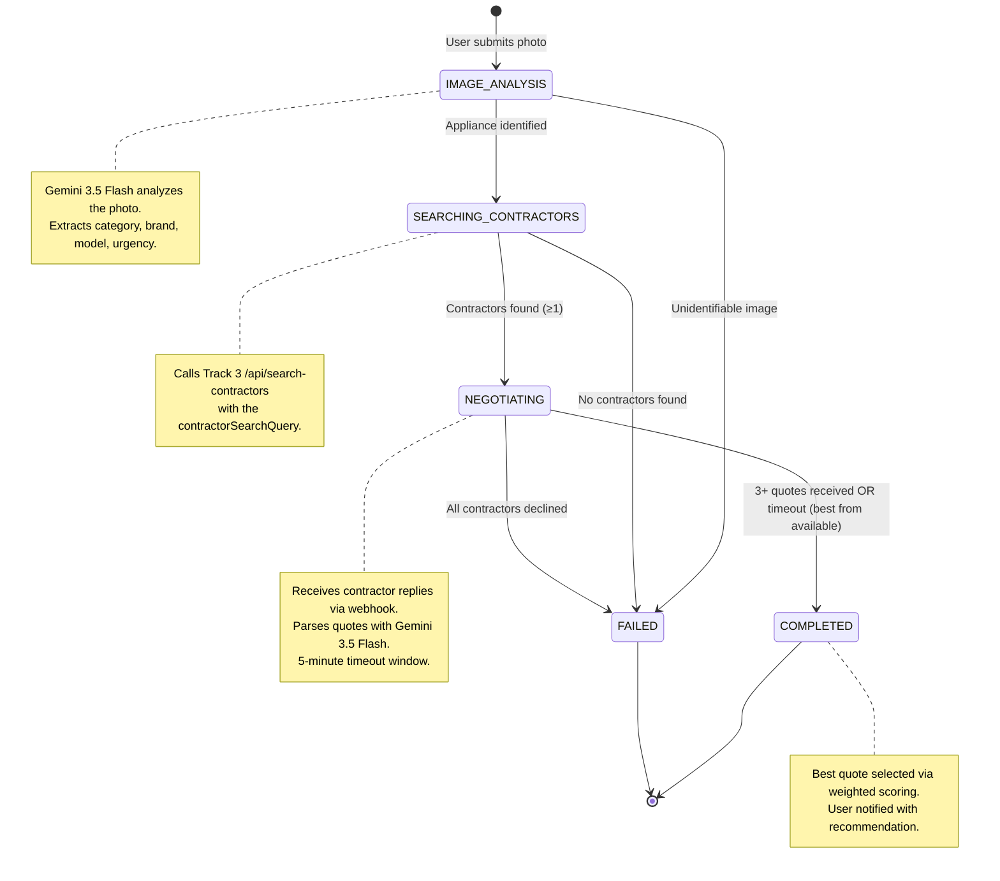
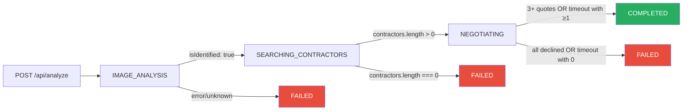

# Agent Decision Tree & State Machine

> [!IMPORTANT]
> **Executive Summary:** The agent state machine governs the entire lifecycle of a maintenance request — from analyzing a photo with Gemini 3.5 Flash, through contractor search and negotiation, to presenting the best quote. This document defines all states, transitions, the weighted scoring algorithm for selecting the best quote, and the complete `stateManager.js` implementation.

---

## State Machine Diagram



---

## State Definitions

### `IMAGE_ANALYSIS`

| Property | Value |
|----------|-------|
| **Trigger** | User submits a photo via `POST /api/analyze` |
| **Action** | Fetch image → Send to Gemini 3.5 Flash → Parse analysis result |
| **Success → ** | `SEARCHING_CONTRACTORS` (when `isIdentified: true` or `category !== "unknown"`) |
| **Failure → ** | `FAILED` (when image is unparseable, corrupt, or completely unidentifiable) |
| **Timeout** | 15 seconds (Gemini API + image fetch) |

### `SEARCHING_CONTRACTORS`

| Property | Value |
|----------|-------|
| **Trigger** | Successful image analysis with a `contractorSearchQuery` |
| **Action** | Call Track 3's `POST /api/search-contractors` with the query |
| **Success → ** | `NEGOTIATING` (when ≥ 1 contractor returned) |
| **Failure → ** | `FAILED` (when 0 contractors found or search API error) |
| **Timeout** | 10 seconds |

### `NEGOTIATING`

| Property | Value |
|----------|-------|
| **Trigger** | Contractors found; agent waits for replies via webhook |
| **Action** | Receive replies → Parse with Gemini 3.5 Flash → Store quotes |
| **Success → ** | `COMPLETED` (when 3+ valid quotes received, OR 5-minute timeout with ≥ 1 quote) |
| **Failure → ** | `FAILED` (all contractors declined, OR timeout with 0 valid quotes) |
| **Timeout** | **5 minutes** (negotiation window) |

### `COMPLETED`

| Property | Value |
|----------|-------|
| **Trigger** | Quote threshold met or timeout with available quotes |
| **Action** | Run scoring algorithm → Select best quote → Notify user |
| **Terminal** | Yes |

### `FAILED`

| Property | Value |
|----------|-------|
| **Trigger** | Any unrecoverable error in the pipeline |
| **Action** | Store failure reason → Notify user |
| **Terminal** | Yes |

---

## Transition Flow



---

## Best Quote Selection Algorithm

### Weighted Scoring Formula

```
score = (priceScore × 0.60) + (availabilityScore × 0.25) + (ratingScore × 0.15)
```

| Factor | Weight | Normalization |
|--------|--------|--------------|
| **Price** | 60% | `1 - (price / maxPrice)` — lower is better |
| **Availability** | 25% | Sooner is better (see table below) |
| **Contractor Rating** | 15% | `rating / 5.0` — higher is better |

### Availability Scoring

| Availability | Score | Examples |
|-------------|-------|---------|
| Today | 1.0 | "available today", "can come now" |
| Tomorrow | 0.9 | "tomorrow morning" |
| This week | 0.7 | "Thursday or Friday", "this week" |
| Next week | 0.5 | "next Monday", "early next week" |
| 2+ weeks | 0.3 | "in two weeks", "next month" |
| Unknown | 0.4 | No availability mentioned |

### Scoring Code

```javascript
/**
 * Calculates a weighted score for a contractor quote.
 *
 * @param {Object} quote - Parsed quote from negotiation service
 * @param {number} maxPrice - Highest price among all quotes (for normalization)
 * @param {number} contractorRating - Contractor's rating (0–5 scale)
 * @returns {number} Score between 0 and 1 (higher is better)
 */
function calculateQuoteScore(quote, maxPrice, contractorRating = 4.0) {
  // Price score: lower price → higher score
  const priceScore = maxPrice > 0 ? 1 - (quote.priceQuote / maxPrice) : 0.5;

  // Availability score: sooner → higher score
  const availabilityScore = scoreAvailability(quote.availability);

  // Rating score: higher rating → higher score
  const ratingScore = (contractorRating || 4.0) / 5.0;

  const totalScore = (priceScore * 0.60) + (availabilityScore * 0.25) + (ratingScore * 0.15);

  return Math.round(totalScore * 1000) / 1000; // 3 decimal places
}

function scoreAvailability(availability) {
  if (!availability) return 0.4;

  const lower = availability.toLowerCase();

  if (lower.includes('today') || lower.includes('now') || lower.includes('immediately')) return 1.0;
  if (lower.includes('tomorrow')) return 0.9;
  if (lower.includes('thursday') || lower.includes('friday') || lower.includes('this week')
      || lower.includes('wednesday') || lower.includes('tuesday')) return 0.7;
  if (lower.includes('next week') || lower.includes('monday') || lower.includes('next monday')) return 0.5;
  if (lower.includes('two weeks') || lower.includes('2 weeks') || lower.includes('month')) return 0.3;

  return 0.4; // Default for unparseable availability
}
```

### Example Scoring

| Contractor | Price | Availability | Rating | Price Score | Avail Score | Rating Score | **Total** |
|-----------|-------|-------------|--------|-------------|-------------|-------------|-----------|
| Mike's HVAC | $385 | Thu/Fri this week | 4.8 | 0.144* | 0.700 | 0.960 | **0.607** |
| CoolAir Pros | $450 | Next Monday | 4.5 | 0.000 | 0.500 | 0.900 | **0.260** |

*Normalized: 1 - (385/450) = 0.144, × 0.60 = 0.087*

**Winner: Mike's HVAC** with the highest weighted score.

---

## Complete `stateManager.js`

```javascript
// src/services/stateManager.js

import { v4 as uuidv4 } from 'uuid';

// In-memory conversation store
const conversations = new Map();

// Negotiation timeout: 5 minutes
const NEGOTIATION_TIMEOUT_MS = 5 * 60 * 1000;
const QUOTE_THRESHOLD = 3;

/**
 * Creates a new conversation after image analysis.
 */
export function createConversation(analysis, contractors = []) {
  const id = uuidv4();
  const conversation = {
    id,
    state: 'IMAGE_ANALYSIS',
    analysis,
    contractors,
    quotes: [],
    bestQuote: null,
    failureReason: null,
    createdAt: new Date().toISOString(),
    updatedAt: new Date().toISOString(),
    negotiationStartedAt: null,
    timeoutHandle: null,
  };

  conversations.set(id, conversation);
  console.log(`[StateManager] Created conversation ${id} in state IMAGE_ANALYSIS`);
  return conversation;
}

/**
 * Retrieves a conversation by ID.
 */
export function getConversation(id) {
  const conversation = conversations.get(id);
  if (!conversation) {
    throw new Error(`Conversation not found: ${id}`);
  }
  return conversation;
}

/**
 * Transitions a conversation to a new state.
 */
export function updateState(id, newState, meta = {}) {
  const conversation = getConversation(id);
  const oldState = conversation.state;

  // Validate transition
  const validTransitions = {
    'IMAGE_ANALYSIS':         ['SEARCHING_CONTRACTORS', 'FAILED'],
    'SEARCHING_CONTRACTORS':  ['NEGOTIATING', 'FAILED'],
    'NEGOTIATING':            ['COMPLETED', 'FAILED'],
    'COMPLETED':              [],
    'FAILED':                 [],
  };

  if (!validTransitions[oldState]?.includes(newState)) {
    throw new Error(`Invalid state transition: ${oldState} → ${newState}`);
  }

  conversation.state = newState;
  conversation.updatedAt = new Date().toISOString();

  if (newState === 'NEGOTIATING') {
    conversation.negotiationStartedAt = new Date().toISOString();
    startNegotiationTimeout(id);
  }

  if (newState === 'FAILED') {
    conversation.failureReason = meta.reason || 'Unknown failure';
    clearNegotiationTimeout(conversation);
  }

  if (newState === 'COMPLETED') {
    clearNegotiationTimeout(conversation);
  }

  Object.assign(conversation, meta);

  console.log(`[StateManager] ${id}: ${oldState} → ${newState}`);
  return conversation;
}

/**
 * Adds a parsed quote to a conversation.
 * Returns true if the quote threshold is met.
 */
export function addQuote(id, quote) {
  const conversation = getConversation(id);

  if (conversation.state !== 'NEGOTIATING') {
    console.warn(`[StateManager] Cannot add quote in state: ${conversation.state}`);
    return false;
  }

  // Ignore duplicate contractor replies
  const isDuplicate = conversation.quotes.some(
    q => q.contractorName === quote.contractorName
  );
  if (isDuplicate) {
    console.warn(`[StateManager] Duplicate reply from ${quote.contractorName}, ignoring`);
    return false;
  }

  // Don't count declined quotes toward threshold
  if (!quote.isDeclined && quote.priceQuote !== null) {
    conversation.quotes.push({
      ...quote,
      receivedAt: new Date().toISOString(),
    });
  } else {
    console.log(`[StateManager] ${quote.contractorName} declined or gave no price`);
  }

  conversation.updatedAt = new Date().toISOString();

  // Check if we've hit the threshold
  return conversation.quotes.length >= QUOTE_THRESHOLD;
}

/**
 * Selects the best quote using weighted scoring.
 */
export function selectBestQuote(id, contractorRatings = {}) {
  const conversation = getConversation(id);

  if (conversation.quotes.length === 0) {
    return null;
  }

  const maxPrice = Math.max(...conversation.quotes.map(q => q.priceQuote));

  let bestScore = -1;
  let bestQuote = null;

  for (const quote of conversation.quotes) {
    const rating = contractorRatings[quote.contractorName] || 4.0;
    const score = calculateQuoteScore(quote, maxPrice, rating);
    quote.score = score;

    if (score > bestScore) {
      bestScore = score;
      bestQuote = quote;
    }
  }

  conversation.bestQuote = bestQuote;
  conversation.updatedAt = new Date().toISOString();

  console.log(`[StateManager] Best quote for ${id}: ${bestQuote.contractorName} ($${bestQuote.priceQuote}, score: ${bestScore})`);
  return bestQuote;
}

/**
 * Starts a 5-minute negotiation timeout.
 */
function startNegotiationTimeout(id) {
  const conversation = conversations.get(id);
  if (!conversation) return;

  conversation.timeoutHandle = setTimeout(() => {
    console.log(`[StateManager] Negotiation timeout for ${id}`);
    const conv = conversations.get(id);
    if (conv && conv.state === 'NEGOTIATING') {
      if (conv.quotes.length > 0) {
        selectBestQuote(id);
        updateState(id, 'COMPLETED', { reason: 'Timeout — selected best from available quotes' });
      } else {
        updateState(id, 'FAILED', { reason: 'Negotiation timeout — no valid quotes received' });
      }
    }
  }, NEGOTIATION_TIMEOUT_MS);
}

function clearNegotiationTimeout(conversation) {
  if (conversation.timeoutHandle) {
    clearTimeout(conversation.timeoutHandle);
    conversation.timeoutHandle = null;
  }
}

// Helper: scoring functions (exported for testing)
export function calculateQuoteScore(quote, maxPrice, contractorRating = 4.0) {
  const priceScore = maxPrice > 0 ? 1 - (quote.priceQuote / maxPrice) : 0.5;
  const availabilityScore = scoreAvailability(quote.availability);
  const ratingScore = (contractorRating || 4.0) / 5.0;

  return Math.round(((priceScore * 0.60) + (availabilityScore * 0.25) + (ratingScore * 0.15)) * 1000) / 1000;
}

function scoreAvailability(availability) {
  if (!availability) return 0.4;
  const lower = availability.toLowerCase();
  if (lower.includes('today') || lower.includes('now')) return 1.0;
  if (lower.includes('tomorrow')) return 0.9;
  if (lower.includes('this week') || /\b(tue|wed|thu|fri)\w*\b/.test(lower)) return 0.7;
  if (lower.includes('next week') || lower.includes('next monday')) return 0.5;
  if (lower.includes('two weeks') || lower.includes('2 weeks')) return 0.3;
  return 0.4;
}

/**
 * Returns a sanitized view of the conversation (no internal handles).
 */
export function getConversationView(id) {
  const conv = getConversation(id);
  return {
    id: conv.id,
    state: conv.state,
    analysis: conv.analysis,
    quotes: conv.quotes,
    bestQuote: conv.bestQuote,
    failureReason: conv.failureReason,
    createdAt: conv.createdAt,
    updatedAt: conv.updatedAt,
  };
}

// Export the store size for health checks
export function getActiveConversationCount() {
  return conversations.size;
}
```

> [!CAUTION]
> **In-memory storage is lost on server restart.** This is acceptable for a 5-hour hackathon. For production, replace the `Map` with Redis or a database.

---

## Checklists

- [ ] State machine implemented in `src/services/stateManager.js`
- [ ] All 5 states defined: `IMAGE_ANALYSIS`, `SEARCHING_CONTRACTORS`, `NEGOTIATING`, `COMPLETED`, `FAILED`
- [ ] State transition validation (prevents invalid transitions)
- [ ] Quote scoring algorithm implemented with price (60%), availability (25%), rating (15%)
- [ ] 5-minute negotiation timeout with auto-completion
- [ ] Duplicate contractor reply detection
- [ ] Declined quotes excluded from scoring
- [ ] `getConversationView()` strips internal handles for API responses
- [ ] All state transitions logged to console
- [ ] Tested: happy path, all-declined path, timeout path, duplicate reply path
