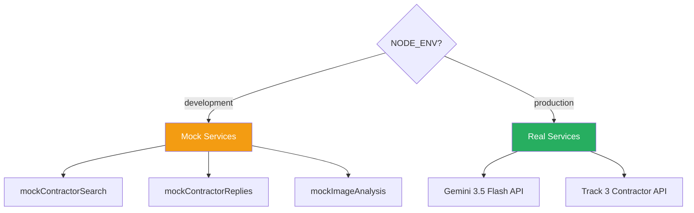

# Mocking Responses for Development & Testing

> [!IMPORTANT]
> **Executive Summary:** Pre-built mock data for contractor searches, contractor replies, and parsed quotes that enable full development and testing without external API dependencies. Use `NODE_ENV=development` to activate mock mode. This allows the entire agent flow to be demonstrated end-to-end without requiring real Gemini 3.5 Flash calls or Track 3 contractor APIs.

---

## Mock Mode Architecture



---

## 1. Mock Contractor Search Response

This simulates the response from Track 3's `POST /api/search-contractors` endpoint.

```javascript
// src/mocks/mockContractors.js

export const MOCK_CONTRACTORS = [
  {
    id: 'contractor_mike_001',
    name: "Mike's HVAC Solutions",
    phone: '+1-555-0101',
    email: 'mike@mikeshvac.com',
    rating: 4.8,
    specialties: ['HVAC repair', 'AC installation', 'furnace maintenance'],
    serviceArea: 'Phoenix Metro Area',
    responseTime: 'Usually responds within 1 hour',
    yearsInBusiness: 12,
  },
  {
    id: 'contractor_coolair_002',
    name: 'CoolAir Pros',
    phone: '+1-555-0202',
    email: 'service@coolairpros.com',
    rating: 4.5,
    specialties: ['HVAC repair', 'duct cleaning', 'commercial HVAC'],
    serviceArea: 'Phoenix & Scottsdale',
    responseTime: 'Usually responds within 2 hours',
    yearsInBusiness: 8,
  },
  {
    id: 'contractor_valley_003',
    name: 'Valley Climate Control',
    phone: '+1-555-0303',
    email: 'info@valleyclimate.com',
    rating: 4.2,
    specialties: ['HVAC repair', 'thermostat installation', 'refrigerant recharge'],
    serviceArea: 'East Valley (Mesa, Tempe, Chandler)',
    responseTime: 'Usually responds within 3 hours',
    yearsInBusiness: 5,
  },
];
```

---

## 2. Mock Contractor Reply Messages

These simulate natural-language text/email replies from contractors.

```javascript
// src/mocks/mockReplies.js

export const MOCK_CONTRACTOR_REPLIES = [
  {
    contractorId: 'contractor_mike_001',
    contractorName: "Mike's HVAC Solutions",
    message: "Hey, I looked at the model you sent. That's a Carrier unit, pretty common fix. I can do it for $385 and I'm available this Thursday or Friday. Let me know!",
    delayMs: 2000, // Simulate 2-second response time
  },
  {
    contractorId: 'contractor_coolair_002',
    contractorName: 'CoolAir Pros',
    message: "We can handle that repair. Our rate for that model would be $450. Earliest availability is next Monday. We also offer a 90-day warranty on all HVAC repairs.",
    delayMs: 5000, // Simulate 5-second response time
  },
  {
    contractorId: 'contractor_valley_003',
    contractorName: 'Valley Climate Control',
    message: "Thanks for reaching out. Unfortunately, we're fully booked for the next two weeks. We'd have to pass on this one. Good luck with the repair!",
    delayMs: 8000, // Simulate 8-second response time
  },
];
```

---

## 3. Mock Parsed Quote Structures

These are the expected outputs after Gemini 3.5 Flash processes each contractor reply via the Negotiation Parse Prompt.

```javascript
// src/mocks/mockParsedQuotes.js

export const MOCK_PARSED_QUOTES = [
  {
    contractorName: "Mike's HVAC Solutions",
    priceQuote: 385,
    currency: 'USD',
    availability: 'Thursday or Friday this week',
    isDeclined: false,
    counterOffer: null,
    notes: 'Common Carrier unit fix',
  },
  {
    contractorName: 'CoolAir Pros',
    priceQuote: 450,
    currency: 'USD',
    availability: 'Next Monday',
    isDeclined: false,
    counterOffer: null,
    notes: '90-day warranty on all HVAC repairs',
  },
  {
    contractorName: 'Valley Climate Control',
    priceQuote: null,
    currency: 'USD',
    availability: null,
    isDeclined: true,
    counterOffer: null,
    notes: 'Fully booked for the next two weeks',
  },
];
```

### Expected Scoring Results

| Contractor | Price | Avail Score | Rating | Total Score | Outcome |
|-----------|-------|-------------|--------|-------------|---------|
| Mike's HVAC | $385 | 0.70 (this week) | 4.8 | **0.607** | ✅ **Winner** |
| CoolAir Pros | $450 | 0.50 (next week) | 4.5 | 0.260 | Runner-up |
| Valley Climate | — | — | 4.2 | — | ❌ Declined |

---

## 4. Mock Image Analysis Response

```javascript
// src/mocks/mockAnalysis.js

export const MOCK_IMAGE_ANALYSIS = {
  status: 'success',
  isIdentified: true,
  category: 'hvac',
  brand: 'Carrier',
  modelNumber: '24ACC636A003',
  messageToUser: 'I identified your Carrier HVAC unit (model 24ACC636A003). It appears to have a refrigerant leak based on the ice buildup on the evaporator coils. I\'ll search for qualified HVAC technicians in your area.',
  contractorSearchQuery: 'HVAC repair Carrier 24ACC636A003 refrigerant leak',
  urgencyLevel: 'high',
  issueDescription: 'Carrier HVAC unit with suspected refrigerant leak - ice buildup visible on evaporator coils',
};
```

---

## 5. Mock Service Implementation

```javascript
// src/services/mockService.js

import { MOCK_CONTRACTORS } from '../mocks/mockContractors.js';
import { MOCK_CONTRACTOR_REPLIES } from '../mocks/mockReplies.js';
import { MOCK_PARSED_QUOTES } from '../mocks/mockParsedQuotes.js';
import { MOCK_IMAGE_ANALYSIS } from '../mocks/mockAnalysis.js';

const isMockMode = () => process.env.NODE_ENV === 'development';

/**
 * Mock image analysis — returns immediately without calling Gemini.
 */
export async function mockAnalyzeImage(imageUrl) {
  console.log(`[MOCK] Analyzing image: ${imageUrl}`);
  // Simulate API latency
  await new Promise(resolve => setTimeout(resolve, 500));
  return { ...MOCK_IMAGE_ANALYSIS };
}

/**
 * Mock contractor search — returns 3 contractors immediately.
 */
export async function mockSearchContractors(query) {
  console.log(`[MOCK] Searching contractors for: "${query}"`);
  await new Promise(resolve => setTimeout(resolve, 300));
  return [...MOCK_CONTRACTORS];
}

/**
 * Mock contractor reply parsing — returns pre-built parsed quote.
 */
export async function mockParseContractorReply(message, contractorName) {
  console.log(`[MOCK] Parsing reply from: ${contractorName}`);
  await new Promise(resolve => setTimeout(resolve, 200));

  const mockQuote = MOCK_PARSED_QUOTES.find(q => q.contractorName === contractorName);
  if (mockQuote) return { ...mockQuote };

  // Fallback for unknown contractors
  return {
    contractorName,
    priceQuote: 400,
    currency: 'USD',
    availability: 'Next week',
    isDeclined: false,
    counterOffer: null,
    notes: 'Mock fallback quote',
  };
}

export { isMockMode };
```

### Toggling Between Mock and Real Services

```javascript
// src/services/visionService.js

import { mockAnalyzeImage, isMockMode } from './mockService.js';

export async function analyzeImage(imageUrl) {
  if (isMockMode()) {
    return mockAnalyzeImage(imageUrl);
  }

  // Real Gemini 3.5 Flash implementation...
  // (see 03_VISION_MODEL_INTEGRATION.md)
}
```

```javascript
// src/services/contractorService.js

import { mockSearchContractors, isMockMode } from './mockService.js';

export async function searchContractors(query) {
  if (isMockMode()) {
    return mockSearchContractors(query);
  }

  // Real Track 3 API call...
  const response = await fetch('http://localhost:8080/api/search-contractors', {
    method: 'POST',
    headers: { 'Content-Type': 'application/json' },
    body: JSON.stringify({ query }),
  });
  return response.json();
}
```

---

## 6. curl Examples for Testing

### Test 1: Analyze an Image (Mock Mode)

```bash
# Start server in mock mode
NODE_ENV=development node src/index.js

# Submit an image for analysis
curl -X POST http://localhost:3000/api/analyze \
  -H "Content-Type: application/json" \
  -d '{
    "imageUrl": "https://example.com/broken-hvac.jpg",
    "userId": "test_user_001"
  }'
```

**Expected response:**
```json
{
  "conversationId": "abc-123-def",
  "state": "SEARCHING_CONTRACTORS",
  "analysis": {
    "category": "hvac",
    "brand": "Carrier",
    "modelNumber": "24ACC636A003"
  },
  "contractorsContacted": 3
}
```

### Test 2: Send Contractor Reply — Mike (Quote)

```bash
curl -X POST http://localhost:3000/api/contractor-reply \
  -H "Content-Type: application/json" \
  -d '{
    "conversationId": "<CONVERSATION_ID_FROM_STEP_1>",
    "contractorId": "contractor_mike_001",
    "contractorName": "Mike'\''s HVAC Solutions",
    "message": "I can do it for $385. Available Thursday or Friday."
  }'
```

### Test 3: Send Contractor Reply — CoolAir (Quote)

```bash
curl -X POST http://localhost:3000/api/contractor-reply \
  -H "Content-Type: application/json" \
  -d '{
    "conversationId": "<CONVERSATION_ID_FROM_STEP_1>",
    "contractorId": "contractor_coolair_002",
    "contractorName": "CoolAir Pros",
    "message": "Our rate would be $450. Earliest availability is next Monday."
  }'
```

### Test 4: Send Contractor Reply — Valley (Decline)

```bash
curl -X POST http://localhost:3000/api/contractor-reply \
  -H "Content-Type: application/json" \
  -d '{
    "conversationId": "<CONVERSATION_ID_FROM_STEP_1>",
    "contractorId": "contractor_valley_003",
    "contractorName": "Valley Climate Control",
    "message": "Unfortunately, we'\''re fully booked. We'\''d have to pass on this one."
  }'
```

### Test 5: Check Conversation Status

```bash
curl http://localhost:3000/api/status/<CONVERSATION_ID_FROM_STEP_1>
```

### Test 6: Health Check

```bash
curl http://localhost:3000/api/health
```

> [!TIP]
> **Demo Day Tip:** Run the full mock flow before your demo to ensure everything works. You can use a bash script to automate all 6 curl commands with `sleep` delays between them to simulate real-time contractor responses.

---

## Demo Script (Automated)

```bash
#!/bin/bash
# demo.sh — Run the full agent flow with mock data

echo "🏠 Starting Maintenance Agent Demo..."
echo ""

# Step 1: Analyze
echo "📸 Step 1: Analyzing broken HVAC image..."
RESPONSE=$(curl -s -X POST http://localhost:3000/api/analyze \
  -H "Content-Type: application/json" \
  -d '{"imageUrl": "https://example.com/broken-hvac.jpg", "userId": "demo_user"}')

CONV_ID=$(echo $RESPONSE | python3 -c "import sys, json; print(json.load(sys.stdin)['conversationId'])")
echo "  Conversation ID: $CONV_ID"
echo "  Response: $RESPONSE"
echo ""

sleep 2

# Step 2: Mike's reply
echo "📞 Step 2: Mike's HVAC Solutions replies..."
curl -s -X POST http://localhost:3000/api/contractor-reply \
  -H "Content-Type: application/json" \
  -d "{\"conversationId\": \"$CONV_ID\", \"contractorId\": \"contractor_mike_001\", \"contractorName\": \"Mike's HVAC Solutions\", \"message\": \"I can do it for \$385. Available Thursday or Friday.\"}"
echo ""

sleep 2

# Step 3: CoolAir's reply
echo "📞 Step 3: CoolAir Pros replies..."
curl -s -X POST http://localhost:3000/api/contractor-reply \
  -H "Content-Type: application/json" \
  -d "{\"conversationId\": \"$CONV_ID\", \"contractorId\": \"contractor_coolair_002\", \"contractorName\": \"CoolAir Pros\", \"message\": \"Our rate would be \$450. Earliest availability is next Monday.\"}"
echo ""

sleep 2

# Step 4: Valley's reply (decline)
echo "📞 Step 4: Valley Climate Control replies (decline)..."
curl -s -X POST http://localhost:3000/api/contractor-reply \
  -H "Content-Type: application/json" \
  -d "{\"conversationId\": \"$CONV_ID\", \"contractorId\": \"contractor_valley_003\", \"contractorName\": \"Valley Climate Control\", \"message\": \"Unfortunately, we're fully booked. We'd have to pass.\"}"
echo ""

sleep 1

# Step 5: Final status
echo "📊 Step 5: Final conversation status..."
curl -s http://localhost:3000/api/status/$CONV_ID | python3 -m json.tool
echo ""

echo "✅ Demo complete!"
```

---

## Checklists

- [ ] Mock contractors defined in `src/mocks/mockContractors.js`
- [ ] Mock replies defined in `src/mocks/mockReplies.js`
- [ ] Mock parsed quotes defined in `src/mocks/mockParsedQuotes.js`
- [ ] Mock image analysis defined in `src/mocks/mockAnalysis.js`
- [ ] `mockService.js` implements all mock functions
- [ ] `isMockMode()` checks `NODE_ENV === 'development'`
- [ ] Service files toggle between mock and real based on `isMockMode()`
- [ ] All curl examples tested and produce expected responses
- [ ] Demo script (`demo.sh`) runs the full flow end-to-end
- [ ] Mock data matches the expected schemas from `02_PROMPT_ENGINEERING.md`
